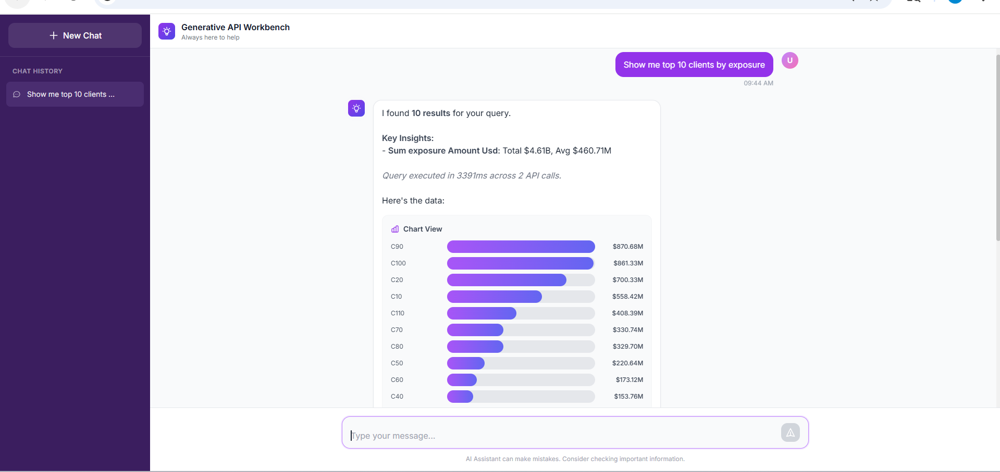

# 🔬 Generative API Workbench

> A cutting-edge Natural Language Query (NLQ) engine that translates plain English into execution plans across distributed enterprise APIs—without copying or warehousing data.

---

## ✨ Features

- **Zero-Copy Data Virtualization**: Fetches, joins, filters, and aggregates data in-memory directly from source APIs. Data stays at the source.
- **Auto-Discovery via OpenAPI**: Parses OpenAPI specifications on startup to automatically discover and map available API endpoints. No hardcoded integrations!
- **Intelligent LLM Planner**: Powered by GPT-4o-mini with sophisticated prompt engineering. Converts user prompts into structured JSON execution plans.
- **Deterministic Execution**: Uses `temperature=0` to ensure reliable and repeatable data processing. 
- **Transparent Tracing**: Full observability into execution times, step-by-step data transformations, and underlying API calls.
- **Rich Data Visualization**: Angular SPA frontend that automatically generates natural language summaries, data tables, and dynamic bar charts.

---

## 📸 Screenshots

.png)
.png)

---

## 🏗️ Architecture

The system operates across three distinct layers:

### 1. Presentation Layer (Angular 17 SPA)
- Modern chat interface built with Tailwind CSS.
- Automatically renders dynamic tables and charts based on the query results.
- Uses Angular Signals for reactive state management.

### 2. Orchestration Layer (FastAPI Backend)
- **LLM Planner**: Interacts with the OpenAI API using strict schemas and constraints.
- **Execution Engine**: Executes the generated JSON plan (FETCH_DATA, JOIN, FILTER, AGGREGATE) against real REST APIs using Python in-memory hash joins.
- **API Registry**: Bootstraps the environment using standard OpenAPI YAML files.

### 3. Data Layer (Source APIs & AWS RDS)
- Mock enterprise microservices representing `Clients`, `Deals`, `Trades`, `Compliance`, and `KYC`.
- Backed by an AWS RDS MySQL database with realistic capital markets data.

---

## 🚀 End-to-End Data Flow

1. **User asks a question** (e.g., *"Show compliance exposure by region for high-risk clients"*)
2. **FastAPI receives the query** and injects API schema and technical docs into the context.
3. **LLM Planner generates an execution plan:**
   - Fetch Compliance API
   - Fetch Clients API
   - Hash Join on `clientId`
   - Filter `riskRating == "HIGH"`
   - Aggregate by `region`, sum `exposureAmountUsd`
4. **Execution Engine processes data** in-memory.
5. **Frontend renders** a natural language summary, data table, and bar chart.

---

## 🛠️ Technology Stack

| Component | Technology | Why we chose it |
| --- | --- | --- |
| **Frontend** | Angular 17.3, Tailwind CSS | Fast rendering, reactive Signals, and quick styling. |
| **Backend** | FastAPI, Uvicorn | Async operations, Pydantic validation, performance. |
| **LLM Engine** | OpenAI SDK, GPT-4o-mini | Cost-effective, high instruction-following accuracy. |
| **Database** | AWS RDS MySQL, SQLAlchemy | Realistic data structure and relational integrity. |
| **API Spec** | OpenAPI 3.0.3 | Industry standard for enterprise REST APIs. |

---

## 🎯 The Magic: Prompt Engineering as "Code"

The brain of the Generative API Workbench lies in its `SYSTEM_PROMPT`. It functions as a domain-specific language specification that:
- Constrains valid operation types and API selection.
- Prevents field hallucination.
- Solves data duplication during complex JOIN operations.
- Enforces strict deterministic outputs.

---

*Built with ❤️ during the Bounteous/Brain AI Hackathon.*